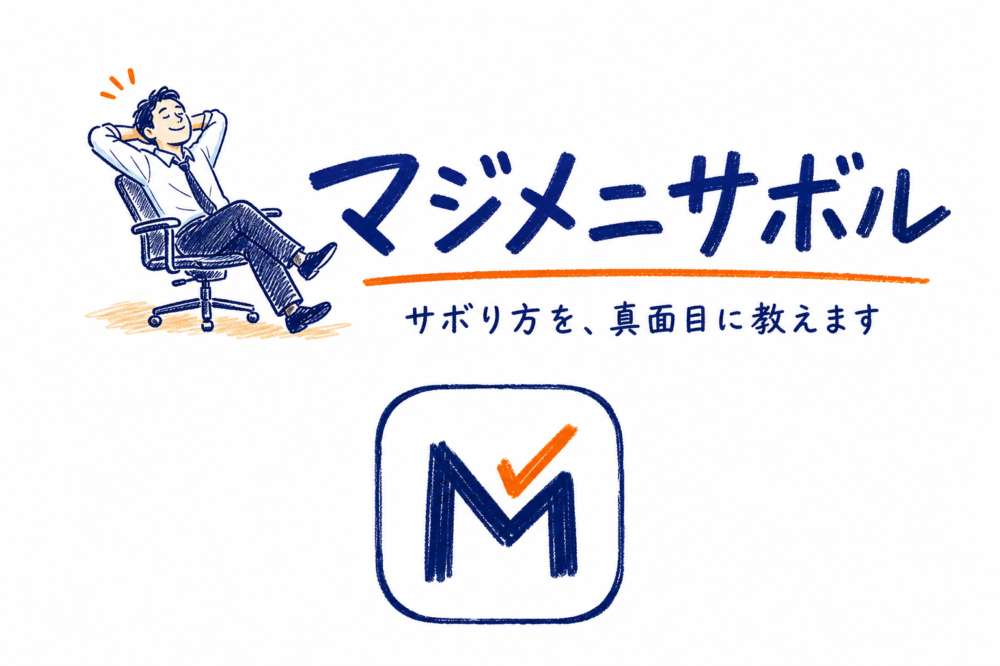
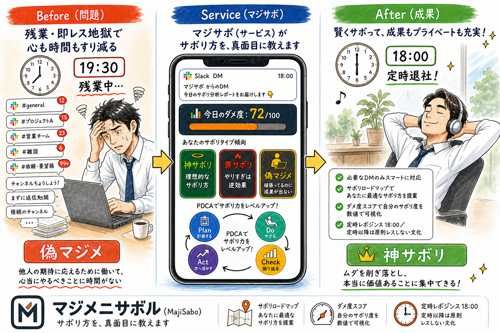
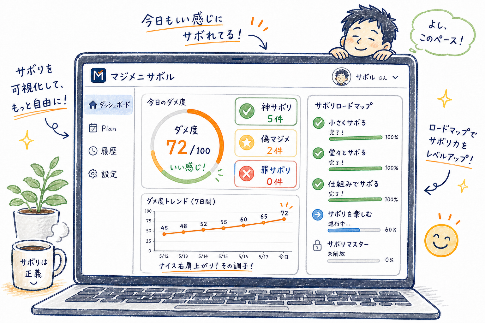
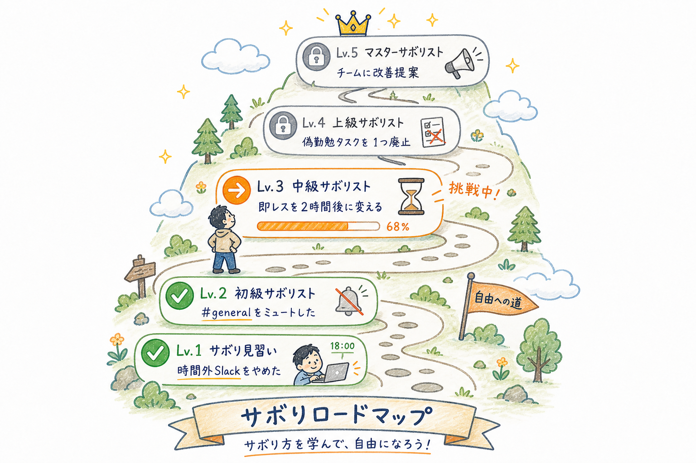
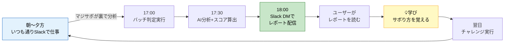
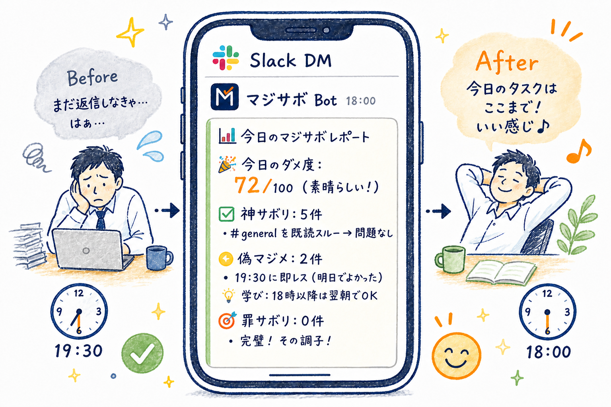

# マジメニサボル（MajiSabo）

<p align="center">
  
</p>

<p align="center">
  <strong>「サボり方を、真面目に教えます」</strong>
</p>

<p align="center">
  
</p>

AWS Summit Japan 2026 AI-DLC ハッカソン「人をダメにするサービス」出場作品

---

## サービス概要

マジメニサボルは、**サボり方を教える学習サービス**です。

あなたのSlackデータを分析し、日々の業務コミュニケーションを3つに分類します：

- **神サボリ** — やらなくても何も困らないこと
- **罪サボリ** — サボると後で困ること
- **偽マジメ** — 頑張っているけど実は無意味なこと

毎日18:00に「今日のサボり成績」が届き、あなたは段階的にサボり方を身につけていきます。

**これは便利ツールではありません。** 使い続けるうちにサボり方を覚え、最終的にはサービスなしでもサボれるようになる — それがマジサボです。

---

## ビジョン

> 「頑張らないことは、サボりではなく最適化である」

日本社会に根付く「勤勉＝美徳」の固定観念をデータに基づいて問い直し、「正しいサボり方」を身につけることで、無駄な努力を手放せる人を増やす。

---

## 主要機能

<p align="center">
  
</p>

| 機能 | 内容 |
|------|------|
| **チャット判定** | Slackのデータを分析し、神サボリ/罪サボリ/偽マジメに自動分類 |
| **定時レスポンス** | 毎日18:00にSlack DMで「今日のマジサボレポート」を配信 |
| **ダメ度スコア** | サボりの上達度を0〜100で数値化 |
| **サボりロードマップ** | Lv.1〜5の段階的ステップで成長を可視化 |
| **サボりチャレンジ** | 「明日やること」を1つ提示し、行動変容を促す |
| **行動追跡** | ミュート後7日間メンションチェックで「サボり成功」を確定 |

<p align="center">
  
</p>

---

## ユーザー体験



### ユーザーの1日

<p align="center">
  
</p>

```
朝〜夕方: いつも通りSlackで仕事する（何も変えない）
    │
    │  ← マジサボが裏でデータを分析
    │
18:00: Slack DMで「今日のマジサボレポート」が届く
    │
    │  🎉 今日のダメ度: 72/100
    │  ✅ 神サボリ: 5件（よくサボりました！）
    │  🟡 偽マジメ: 2件（無駄に頑張りました）
    │  💡 明日のチャレンジ: #general を1日ミュートしてみましょう
    │
    └→ ユーザーはサボり方を「学ぶ」
```

---

## アーキテクチャ

### マイクロサービス構成（8 Unit）

| Unit | 名前 | 責務 | AWS |
|:---:|------|------|-----|
| U1 | auth | 認証 | Cognito |
| U2 | slack-connector | Slackデータ取得 | Lambda + Slack API |
| U3 | judgment-engine | 3分類判定 | Lambda + Bedrock |
| U4 | score-calculator | ダメ度算出 | Lambda |
| U5 | daily-reporter | 定時レスポンス | EventBridge + Lambda |
| U6 | action-tracker | 行動追跡 | Lambda + EventBridge |
| U7 | dashboard-api | REST API | API Gateway + Lambda |
| U8 | dashboard-ui | ダッシュボード | React (CloudFront + S3) |

### 技術スタック

| レイヤー | 技術 | 用途 |
|---------|------|------|
| 🖥️ **フロントエンド** | React + Vite + Chart.js | ダッシュボード・ロードマップUI |
| 🌐 **配信** | CloudFront + S3 | SPA配信（CDN） |
| 🔌 **API** | API Gateway + Lambda | REST API（BFF） |
| 🔐 **認証** | Amazon Cognito | ユーザー認証・トークン管理 |
| 🤖 **AI判定** | Amazon Bedrock (Claude) | 本文分析・判定理由生成 |
| 💾 **データ** | DynamoDB（Unit別テーブル） | 判定結果・スコア・行動記録 |
| ⏰ **スケジューラー** | Amazon EventBridge | 定時レスポンス（18:00）・バッチ処理 |
| 💬 **通知** | Slack Webhook | DM配信 |
| 📡 **外部連携** | Slack API (Bot Token) | チャットデータ取得 |
| 🏗️ **IaC** | AWS CDK (TypeScript) | Unit別スタック管理 |

### 判定エンジン（ハイブリッド2層構造）

```
Layer 1: ルールベース（高速・低コスト）
  → 時間外発言、メンション0チャンネル等を即判定

Layer 2: AI判定（Bedrock Claude）
  → 曖昧なケースのみ本文分析＋判定理由生成
```

---

## AI-DLC成果物

```
project/aidlc-docs/
├── inception/
│   ├── requirements/
│   │   └── final-concept.md          # 最終コンセプト（確定版）
│   ├── user-stories/
│   │   ├── stories.md                # ユーザーストーリー（14件）
│   │   └── personas.md               # ペルソナ（5名）
│   ├── application-design/
│   │   ├── application-design.md     # 統合設計ドキュメント
│   │   ├── components.md             # コンポーネント定義（8件）
│   │   ├── services.md               # サービス定義（6件）
│   │   ├── component-dependency.md   # 依存関係
│   │   ├── unit-of-work.md           # Unit分解（8 Unit）
│   │   ├── unit-of-work-dependency.md # Unit依存関係
│   │   └── unit-of-work-story-map.md # ストーリーマッピング
│   └── plans/
│       ├── execution-plan.md         # 実行計画
│       └── ...
├── aidlc-state.md                    # ワークフロー状態管理
└── audit.md                          # 監査ログ
```

---

## チーム

- 3名（インフラ・クラウド中心）
- AWS全般（IaC〜Lambda開発）

---

## MVP戦略

| フェーズ | スコープ | 時期 |
|---------|---------|------|
| 書類審査 | Inception成果物 | 〜5/10 |
| 予選MVP | チャット判定＋ダメ度＋定時レスポンス | 〜5/30 |
| 決勝 | チームダッシュボード＋ノウハウ共有 | 〜6/26 |

---

## 独自性

| 観点 | 根拠 |
|------|------|
| 直接的な競合なし | チャットから「サボっていいか」を判定し、サボり方を教えるサービスは存在しない |
| 逆転の発想 | 既存ツールは「もっと頑張れ」。マジサボは「もっとサボれ」 |
| 学習サービス | 便利ツールではなく「卒業できる」サービス |
| 独自フレームワーク | 「神サボリ/罪サボリ/偽マジメ」の3分類 |
| ゼロ操作 | 普通に仕事してたら18時に成績表が届く |

---

## ライセンス

MIT License

---

<sub>画像素材は Google Gemini で生成。設計・コンセプト・ドキュメントは AI-DLC プロセスに基づきチームが作成。</sub>
