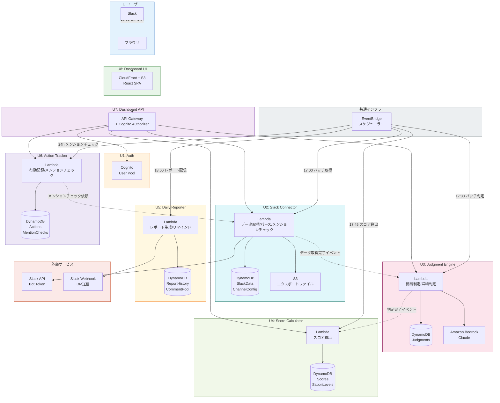

# Application Design（統合ドキュメント）

> **サービス名**: マジメニサボル（マジサボ）
> **アーキテクチャ**: マイクロサービス（8 Unit × 独立CDKスタック）
> **フロントエンド**: React SPA（CloudFront + S3）
> **最終更新**: 2026-05-06

---

## アーキテクチャ概要



---

## コンポーネント構成（8コンポーネント = 8 Unit）

| Unit | コンポーネント | 責務 | 技術 |
|:---:|--------------|------|------|
| U1 | Auth | 認証・セッション管理 | Cognito |
| U2 | SlackConnector | Slackデータ取得・正規化・チャンネル選択UI・メンションチェック | Lambda + Slack API |
| U3 | JudgmentEngine | 3分類判定＋理由生成（ハイブリッド: ルールベース+AI） | Lambda + Bedrock |
| U4 | ScoreCalculator | ダメ度スコア算出・サボりレベル管理 | Lambda |
| U5 | DailyReporter | 定時レスポンス生成・配信・リマインド・チャレンジ提示 | EventBridge + Lambda |
| U6 | ActionTracker | 行動記録・メンション追跡（24h×7日）・結果判定 | Lambda + EventBridge |
| U7 | Dashboard API | REST API提供（BFF） | API Gateway + Lambda |
| U8 | Dashboard UI | ダッシュボード＋サボりロードマップ | React (S3 + CloudFront) |

詳細: [components.md](./components.md)

---

## サービス構成（6サービス）

| # | サービス | トリガー | 主要処理 |
|---|---------|---------|---------|
| S1 | DataIngestion | Events API + EventBridge(17:00) | Slackデータ取得・正規化 |
| S2 | Judgment | S1完了 + EventBridge(17:30) | 3分類判定（ルールベース簡易+AI詳細） |
| S3 | Score | S2完了(17:45) | ダメ度スコア算出・レベル判定 |
| S4 | Report | EventBridge(18:00) | 定時レスポンス＋チャレンジ生成・配信 |
| S5 | Action | ユーザー操作 + EventBridge(24h×7日) | 行動記録・メンション追跡 |
| S6 | Dashboard | ユーザーリクエスト | データ提供API |

詳細: [services.md](./services.md)

---

## データ保持方針（マイクロサービス原則）

| 方針 | 内容 |
|------|------|
| **各Unitが自分のデータを保持** | Unit間でDynamoDBテーブルを直接参照しない |
| **データが必要な場合** | API経由 or EventBridgeイベントで取得 |
| **共有可能** | マスタデータ、設定値など読み取り専用データのみ |

### Unit別DynamoDBテーブル

| Unit | テーブル | 用途 |
|:---:|---------|------|
| U1 | — | Cognito User Pool（マネージド） |
| U2 | SlackData, ChannelConfig | 正規化チャットデータ、チャンネル設定 |
| U3 | Judgments | 判定結果（分類、理由、確信度） |
| U4 | Scores, SaboriLevels | 日次スコア、サボりレベル・ロードマップ進捗 |
| U5 | ReportHistory, CommentPool | レポート配信履歴、コメントプール |
| U6 | Actions, MentionChecks | 行動記録、メンションチェック結果 |
| U7 | — | データ保持なし（BFF、他Unitに委譲） |
| U8 | — | データ保持なし（フロントエンド） |

---

## 判定エンジンの動作モード（技術的工夫）

### ハイブリッド判定アーキテクチャ

単純な「Bedrock丸投げ」ではなく、**ルールベース + AI の2層構造**：

```
Layer 1: ルールベース判定（高速・低コスト）
  ├─ 時間外発言 → 偽勤勉（確定）
  ├─ メンション0回チャンネル → 神怠惰（確定）
  ├─ 自分宛メンション + 質問キーワード → 罪怠惰（確定）
  └─ 上記に該当しない → Layer 2へ

Layer 2: AI判定（Bedrock Claude）
  ├─ 本文の意図分析（質問/依頼/報告/雑談の分類）
  ├─ コンテキスト判定（報告系は反応なしでも正常）
  ├─ 判定理由の自然言語生成
  └─ 確信度スコア付与
```

**技術的工夫のポイント**:
1. Layer 1で70%のケースを処理 → Bedrockコスト削減
2. Layer 2は曖昧なケースのみ → AI判定の精度が高い領域に集中
3. 判定理由を必ず生成 → ユーザーの学習に直結
4. 確信度スコア → 低確信度は「判定保留」にして誤判定を防止

---

## コアフロー優先方針

### 予選MVP実装の優先順位

8 Unitを全て完璧に作るのではなく、**コアフロー（データの流れ）を最優先**で動かす。

```
【最優先】コアフロー（これが動けばデモ成立）:
  U2 Slack取得 → U3 判定 → U4 スコア算出 → U5 レポート配信

【次優先】ユーザー体験:
  U1 認証 → U8 ダッシュボード → U7 API

【最後】追跡機能:
  U6 行動追跡（メンションチェック）
```

### フォールバック方針

| 項目 | 目標 | フォールバック（5/22時点で未達の場合） |
|------|------|------|
| フロントエンド | React SPA | HTML + JavaScript + Chart.js |
| Slack連携 | Slack App（Bot Token） | エクスポートファイルアップロードのみ |
| AI判定 | Bedrock Claude | ルールベースのみ（Layer 1だけで動かす） |
| 定時レスポンス | EventBridge + Slack DM | 手動実行でデモ |

**判断日: 5月22日** — この時点でReactが動いていなければHTML+JSに切り替え。

---

## 設計上の決定事項

| 決定 | 理由 |
|------|------|
| React SPA（5/22までに判断） | ダッシュボード+ロードマップUIに最適。経験なしだがKiroで生成 |
| Slack App（Bot Token）メイン | リアルタイムデータ取得可能。エクスポートはフォールバック |
| ハイブリッド判定（ルール+AI） | コスト最適化＋技術的深さのアピール |
| Slack DM配信 | ユーザーが普段使っているSlackに届く |
| シードデータ + 実Slackデータ | デモ用にシードデータ＋実データでも動くことを見せる |
| 本文は分析後に破棄 | プライバシー配慮 |
| Unit単位データ保持 | マイクロサービス原則。直接テーブル参照禁止 |
| コアフロー優先 | U2→U3→U4→U5が動けばデモ成立 |
| 初学者モード | データなしでも一般Tipsを配信。初日から価値提供 |
| デモ用コメントプール | 一言コメントは事前用意。品質担保 |

---

## 依存関係

詳細: [component-dependency.md](./component-dependency.md)

## Unit分解

詳細: [unit-of-work.md](./unit-of-work.md)、[unit-of-work-dependency.md](./unit-of-work-dependency.md)、[unit-of-work-story-map.md](./unit-of-work-story-map.md)
