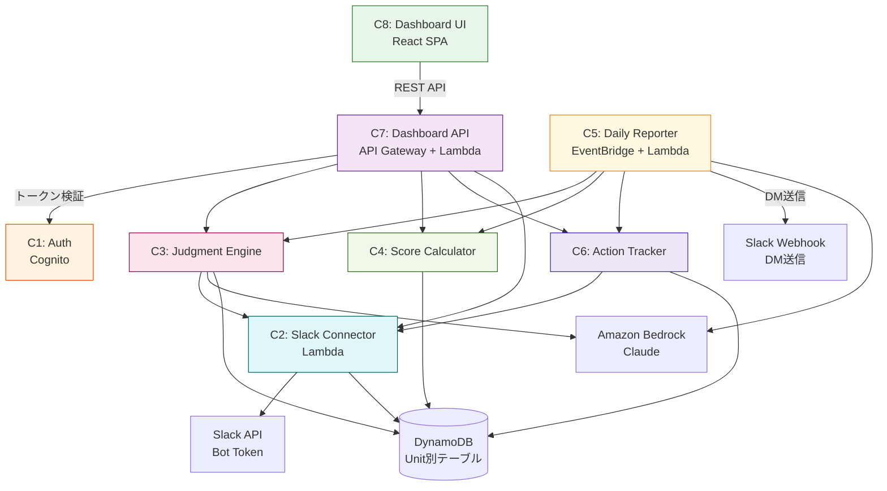
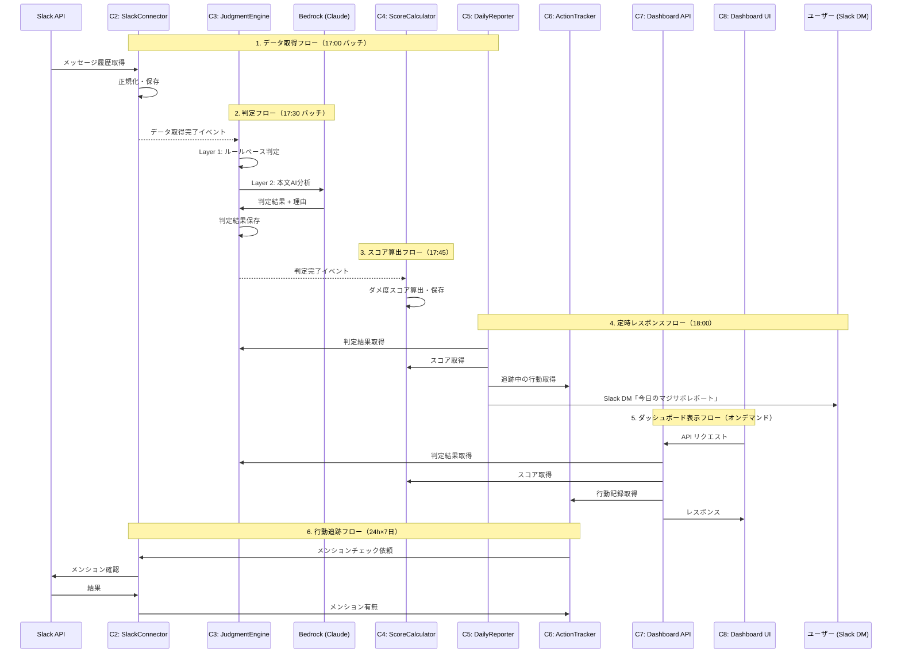

# コンポーネント依存関係

---

## 依存関係図

---

## 依存関係マトリクス

| コンポーネント | 依存先 | 通信方式 | データフロー |
|--------------|--------|---------|------------|
| C8 Dashboard UI | C7 Dashboard API | REST (HTTPS) | 読み取り + 行動記録書き込み |
| C7 Dashboard API | C1 Auth | Cognito Token検証 | 認証 |
| C7 Dashboard API | C3 JudgmentEngine | Lambda呼び出し | 判定結果取得 |
| C7 Dashboard API | C4 ScoreCalculator | Lambda呼び出し | スコア取得 |
| C7 Dashboard API | C6 ActionTracker | Lambda呼び出し | 行動記録・実績取得 |
| C5 DailyReporter | C3 JudgmentEngine | Lambda呼び出し | 日次判定結果取得 |
| C5 DailyReporter | C4 ScoreCalculator | Lambda呼び出し | ダメ度スコア取得 |
| C5 DailyReporter | Slack | Webhook (HTTPS) | DM送信 |
| C5 DailyReporter | Bedrock | API呼び出し | 一言コメント生成 |
| C3 JudgmentEngine | C2 SlackConnector | DynamoDB読み取り | チャットデータ取得 |
| C3 JudgmentEngine | Bedrock | API呼び出し | 本文AI分析・判定理由生成 |
| C2 SlackConnector | Slack API | Bot Token (HTTPS) | メッセージ履歴取得 |
| C2 SlackConnector | DynamoDB | 書き込み | 正規化データ保存 |
| C6 ActionTracker | DynamoDB | 読み書き | 行動記録保存・取得 |
| C4 ScoreCalculator | DynamoDB | 読み取り | 判定結果集計 |

---

## データフロー（メインフロー）

