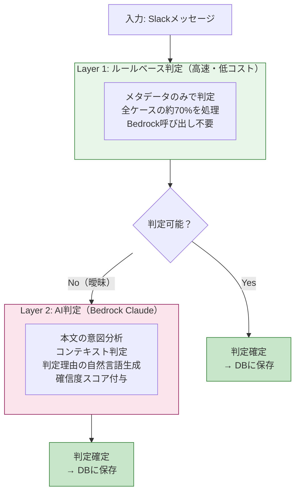
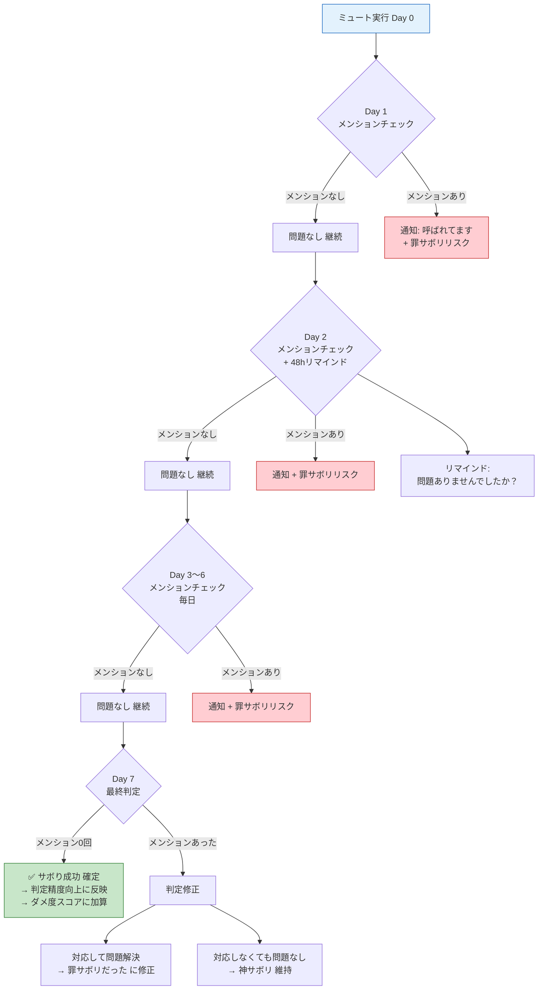
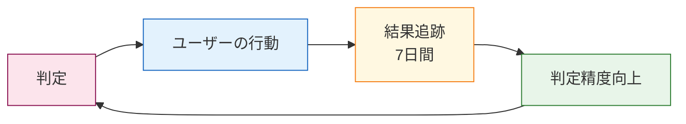
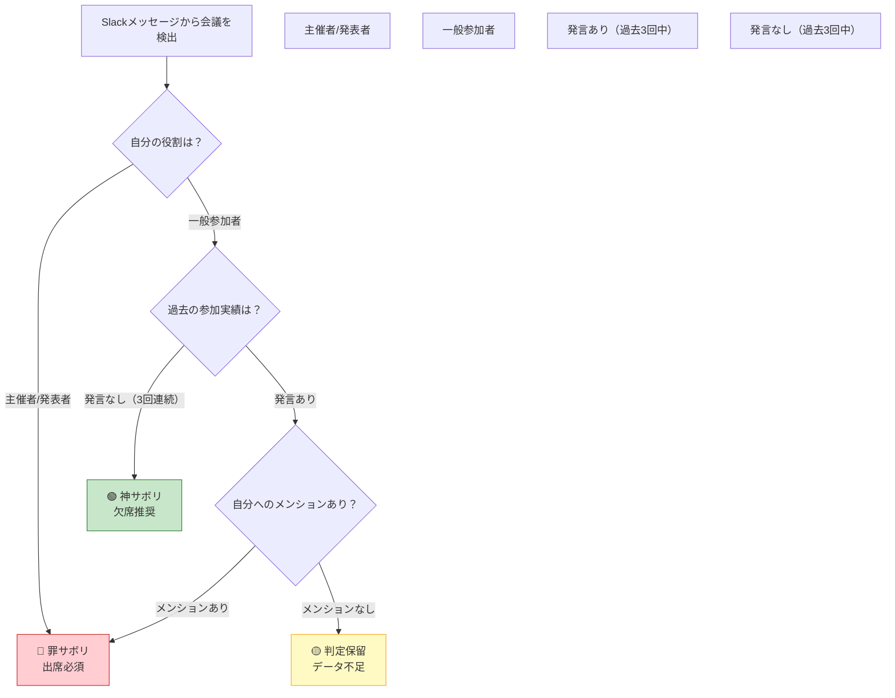
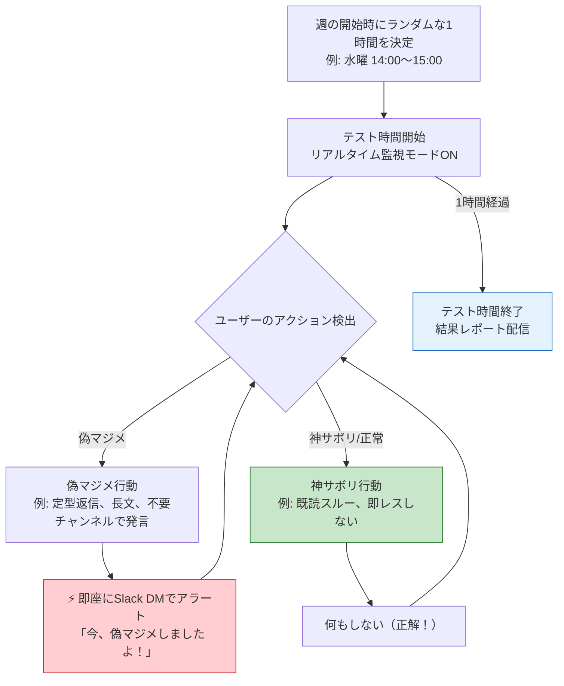

# 判定ロジック詳細設計

> **目的**: チャット（Slack）データから「神サボリ/罪サボリ/偽マジメ」を判定するロジックの詳細定義

---

## 判定アーキテクチャ: ハイブリッド2層構造



---

## Layer 1: ルールベース判定

### 即時判定ルール（メタデータのみ）

| # | 条件 | 判定 | 確信度 |
|---|------|------|:---:|
| R1 | 18:00以降の自分の発言 | 🟡 偽マジメ | 95% |
| R2 | 過去30日メンション0回のチャンネルでの自分の発言 | 🟡 偽マジメ | 90% |
| R3 | 過去30日メンション0回のチャンネルの未読 | 🟢 神サボリ（ミュート推奨） | 95% |
| R4 | 自分宛ダイレクトメンション（質問キーワード含む） | 🔴 罪サボリ | 85% |
| R5 | 自分の発言への反応が3回連続0件 | 🟡 偽マジメ候補 | 75% |
| R6 | 即レス（5分以内）したが相手の次の返信まで4時間以上 | 🟡 偽マジメ（即レス不要だった） | 80% |

### 質問キーワード（R4用）

```
日本語: 「？」「教えて」「確認」「お願い」「いつまで」「期限」「至急」「ASAP」
英語: "?", "please", "could you", "deadline", "urgent", "ASAP"
```

### Layer 1で判定不可 → Layer 2に回すケース

- メンションありだが質問キーワードなし
- 反応なしだが投稿が報告系かもしれない
- 時間内だが発言の価値が不明
- 確信度が75%未満

---

## Layer 2: AI判定（Bedrock Claude）

### プロンプト設計

```
あなたはSlackメッセージの分析AIです。
以下のメッセージを分析し、3分類のいずれかに判定してください。

【3分類の定義】
- 神サボリ: やらなくても何も困らないこと。対応不要。
- 罪サボリ: サボると後で困ること。対応必須。
- 偽マジメ: 頑張っているけど実は無意味なこと。やめるべき。

【判定時の注意】
- 報告系の投稿（「〇〇完了しました」等）は、反応がなくても「正常」です。偽マジメではありません。
- 情報共有（「FYI: 〇〇」等）は、閲覧されていれば価値があります。
- 質問への回答は、質問者が解決すれば十分です。反応不要。
- 上司への報告は、受領されれば十分です。

【入力データ】
- チャンネル名: {channel_name}
- 投稿者: {user_name}（分析対象ユーザー）
- メッセージ本文: {message_text}
- タイムスタンプ: {timestamp}
- リアクション数: {reaction_count}
- スレッド返信数: {thread_reply_count}
- メンション先: {mentions}
- チャンネルの過去30日統計:
  - 対象ユーザーへのメンション回数: {mention_count}
  - 対象ユーザーの発言への平均反応数: {avg_reaction}

【出力形式（JSON）】
{
  "classification": "神サボリ" | "罪サボリ" | "偽マジメ" | "正常",
  "confidence": 0.0〜1.0,
  "reason": "判定理由（ユーザーに表示する説明文）",
  "learning_point": "💡学びポイント（ユーザーがサボり方を学ぶためのアドバイス）",
  "action_suggestion": "次のアクション提案（任意）"
}
```

### AI判定の「正常」カテゴリ

3分類に加えて「正常」を設ける。全てが神サボリ/罪サボリ/偽マジメに分類されるわけではない。

| 分類 | 意味 | ユーザーへの表示 |
|------|------|----------------|
| 神サボリ | やらなくてよかった | 「サボってOK！」 |
| 罪サボリ | やるべきだった | 「これはサボっちゃダメ」 |
| 偽マジメ | やったけど無意味 | 「頑張ったけど意味なかった」 |
| **正常** | 適切な行動 | 表示しない（判定対象外） |

---

## パターン別判定表

### 「反応なし」の判定パターン

| パターン | 投稿タイプ | 反応 | 判定 | 理由 |
|---------|----------|:---:|------|------|
| 上司への報告 | 「〇〇完了しました」 | なし | **正常** | 報告は受領されれば十分 |
| 情報共有 | 「FYI: 〇〇のリンクです」 | なし | **正常** | 閲覧されていれば価値あり |
| 質問への回答 | 「〇〇は△△です」 | なし | **正常** | 質問者が解決すれば十分 |
| 雑談チャンネルでの発言 | 「今日暑いですね」 | なし（3回連続） | **偽マジメ** | 誰も反応しない雑談は時間の浪費 |
| 全体通知チャンネルでの発言 | 「了解です」 | なし（3回連続） | **偽マジメ** | 求められていない発言 |
| 自分から質問 | 「〇〇ってどうすれば？」 | なし | **判定保留** | 回答待ち。時間経過後に再判定 |

### 「時間外」の判定パターン

| パターン | 時間帯 | 内容 | 判定 | 理由 |
|---------|--------|------|------|------|
| 即レス | 18:00以降 | 通常の返信 | **偽マジメ** | 翌朝で間に合う |
| 緊急対応 | 18:00以降 | 「至急」「障害」キーワード含む | **罪サボリ（対応必要）** | 緊急時は対応すべき |
| 雑談 | 18:00以降 | 雑談チャンネル | **偽マジメ** | 業務外の雑談は翌日でよい |
| 自発的投稿 | 18:00以降 | 自分から発信 | **偽マジメ** | 翌朝に投稿すれば十分 |

### 「即レス」の判定パターン

| パターン | 応答時間 | 相手の次の返信 | 判定 | 理由 |
|---------|:---:|:---:|------|------|
| 即レス（5分以内） | 5分 | 相手が4時間後に返信 | **偽マジメ** | 急ぐ必要がなかった |
| 即レス（5分以内） | 5分 | 相手が10分後に返信 | **正常** | 会話のテンポとして適切 |
| 遅延レス（2時間後） | 2時間 | 問題なし | **神サボリ（成功）** | 即レスしなくても問題なかった |

---

## 行動追跡の判定ロジック

### ミュート後の追跡フロー



---

## 判定精度の向上メカニズム

### フィードバックループ



| フィードバック | 影響 |
|-------------|------|
| ミュートして7日間問題なし | 同チャンネルの「神サボリ」確信度が上がる |
| ミュートしたらメンションされた | 同チャンネルの「神サボリ」確信度が下がる |
| 即レスしなくて問題なし | 「即レス不要」の確信度が上がる |
| 即レスしなくて問題発生 | 「罪サボリ」として学習 |
| ユーザーが「問題あり」報告 | 該当パターンの判定を修正 |

### 初学者モード（データ不足時）

データが3日未満の場合、個人データに基づく判定は行わず、一般的なTipsを配信：

| 日数 | モード | 内容 |
|:---:|------|------|
| 0〜2日 | 初学者モード | 一般的なサボりTips配信（解析不要） |
| 3〜7日 | 学習モード | Layer 1（ルールベース）のみで判定開始 |
| 8日以降 | 通常モード | Layer 1 + Layer 2（AI判定）のフル機能 |

---

## 判定結果の出力形式

### 定時レスポンス（18:00）での表示

```
✅ 神サボリ: 5件
  ・#general の雑談を既読スルー → 問題なし
    💡 学び: メンションがない投稿は、あなた宛ではありません
  ・#project-updates を未読スルー → 問題なし
    💡 学び: このチャンネルであなたが呼ばれた回数: 過去30日で0回

🟡 偽マジメ: 2件
  ・誰も反応しないチャンネルで発言（10分の浪費）
    💡 学び: 過去3回の発言に反応ゼロ。このチャンネルでの発言は不要です
    🎯 提案: このチャンネルをミュートしてみましょう
  ・19:30にSlackで即レス（明日でよかった）
    💡 学び: 相手の次の返信は翌朝9:15でした。急ぐ必要はありませんでした
    🎯 提案: 18時以降は翌朝対応にしましょう

🔴 罪サボリ: 0件
  ・今日はパーフェクト！
```

### ダッシュボードでの表示

各判定結果に以下を含める：
- **分類ラベル**（神サボリ/罪サボリ/偽マジメ/正常）
- **確信度**（%表示）
- **判定理由**（1〜2文）
- **学びポイント**（💡）
- **次のアクション提案**（🎯、該当する場合のみ）

---

## 会議判定ロジック（予選Should）

### Slackデータからの会議検出

カレンダー連携なしで、Slackメッセージ内から会議の存在を検出する。

#### 検出パターン

| パターン | 検出方法 | 例 |
|---------|---------|-----|
| カレンダーBot通知 | Slack連携のGoogleカレンダー/OutlookのBot投稿を検出 | 「📅 14:00〜 週次定例ミーティング」 |
| Zoom/Teamsリンク | メッセージ内のzoom.us / teams.microsoft.com URLを検出 | 「https://zoom.us/j/123456」 |
| 招集メッセージ | AI分析で会議招集の意図を検出 | 「@channel 今日15:00から打ち合わせお願いします」 |
| ハドル開始 | Slack Huddle開始イベントを検出 | Huddle通知 |

### 会議判定フロー



### 会議判定の出力例

```
📅 今日の会議判定:

🟢 神サボリ候補: 1件
  ・14:00 週次定例（30分）
    → 過去3回の発言: 0回
    → あなたへのメンション: 0回
    → 判定: 欠席しても問題ない可能性が高い
    💡 学び: 発言しない会議は、議事録で十分です
    🎯 提案: 今日は欠席して、議事録を確認してみましょう

🔴 罪サボリ: 1件
  ・16:00 クライアントレビュー
    → あなたが発表者
    → 判定: 出席必須
```

### 会議サボリの追跡

| 行動 | 追跡方法 | 成功判定 |
|------|---------|---------|
| 会議を欠席した | 会議後のSlackで自分へのメンション有無を確認 | 7日間メンション0回 + 問題報告なし |
| 会議を短縮退出した | — | ユーザーの手動報告 |

### Slackだけで完結するメリット

- カレンダー連携（OAuth）が不要 → セットアップが簡単
- 追加の権限スコープが不要 → 既存のSlack連携だけで動く
- 会議の「空気感」もSlackメッセージから推測可能（会議後の「ありがとうございました」等）

---

## ファイル共有分析（予選Should）

### 判定ロジック

Slack APIの `files.info` でファイルのダウンロード数・プレビュー数を取得。

| 条件 | 判定 | メッセージ |
|------|------|-----------|
| 共有後7日間でダウンロード0回 | 🟡 偽マジメ | 「この資料、共有しましたが誰もダウンロードしていません。作る必要なかったかも」 |
| 共有後7日間でダウンロード1〜2回 | 判定保留 | データ不足。次回も追跡 |
| 共有後7日間でダウンロード3回以上 | 正常 | 読まれている |
| 同じ種類のファイルを3回共有してDL0回が続く | 🟡 偽マジメ確定 | 「このタイプの資料は不要です。作成をやめましょう」 |

### 定時レスポンスでの表示例

```
🟡 偽マジメ: ファイル共有
  ・「週次レポート_0505.xlsx」→ ダウンロード: 0回
    💡 学び: 誰も見ていない資料を作るのは偽マジメです
    🎯 提案: 来週から箇条書き3行のSlack投稿に変えてみましょう
```

---

## ステータス監視（予選Should）

### 判定ロジック

Slack APIの `users.getPresence` でオンライン状態を取得。定時（18:00）以降のオンライン状態を偽マジメとして検出。

| 条件 | 判定 | メッセージ |
|------|------|-----------|
| 18:00以降にオンライン（機能有効時） | 🟡 偽マジメ | 「まだオンラインですか？定時を過ぎています。閉じましょう」 |
| 18:00以降にメッセージ送信 | 🟡 偽マジメ（強） | 「この時間の対応は翌朝で間に合います」 |
| ユーザーが「今日は残業」と設定 | 判定しない | 有効/無効切り替えで対応 |

### 有効/無効切り替え

```
設定画面:
  ⏰ 定時後ステータス監視
    [✅ 有効] / [ 無効]
    
    定時: [18:00] （変更可能）
    
    💡 業務上必要な残業がある日は無効にしてください。
       無効にした日は偽マジメ判定の対象外になります。
```

### 定時レスポンスでの表示例

```
⏰ 時間外アラート
  ・18:00以降のオンライン時間: 1時間32分
  ・18:00以降のメッセージ送信: 5件
  ・「この時間の全ての対応は偽マジメです。
     明日の自分に任せましょう。」
  
  💡 学び: 定時後の対応が翌朝でも問題なかった確率: 94%（過去実績）
```

---

## DM効率化提案（予選Should）

### 判定ロジック

同じ相手とのDM頻度を分析し、チャンネル化を提案する。これは「神サボリ」の提案（DMよりチャンネルの方が楽＝効率化）。

| 条件 | 判定 | メッセージ |
|------|------|-----------|
| 同じ相手と週10回以上DMしている | 🟢 神サボリ提案 | 「この人との会話、専用チャンネルにした方が楽です」 |
| 3人以上のグループDMが頻繁 | 🟢 神サボリ提案 | 「このグループDM、チャンネル化すると検索も楽になります」 |
| DMの内容が他メンバーにも有用 | 🟢 神サボリ提案 | 「この情報、チャンネルで共有すると他の人も助かります」 |

### 定時レスポンスでの表示例

```
🟢 神サボリ提案: DM効率化
  ・田中さんとのDM: 今週14回
    🎯 提案: 専用チャンネル「#佐藤-田中」を作ると、
       検索が楽になり、履歴も残ります。
       DMを毎回探す手間が省けます（神サボリ！）
```

### 「神サボリ」としての位置づけ

DM効率化は「サボる」ではなく「楽をする」提案。
- DMを探す手間 → チャンネルなら一発で見つかる
- 同じ説明を何度もDMする → チャンネルならピン留めで済む
- グループDMの管理 → チャンネルなら参加/退出が自由

**「楽をすることは神サボリである」** — マジサボの思想に合致。

---

## リアクションで済む場面の検出（予選Should）

### 判定ロジック

「了解しました」「承知しました」「ありがとうございます」等の定型返信を検出し、リアクション（👍）で十分だったケースを偽マジメとして判定。

#### 検出パターン

| パターン | 条件 | 判定 |
|---------|------|------|
| 定型返信 | 「了解」「承知」「ありがとう」「確認しました」等のキーワードのみで構成される返信 | 🟡 偽マジメ |
| 短文返信 | 10文字以下の返信（実質リアクションと同じ） | 🟡 偽マジメ候補 |
| 相手の反応 | 定型返信に対して相手が何も返していない | 偽マジメ確定（リアクションで十分だった証拠） |

#### 定時レスポンスでの表示例

```
🟡 偽マジメ: リアクションで済んだ場面 3件
  ・「了解しました。対応いたします。」→ 👍 で十分でした（30秒の節約）
  ・「ありがとうございます！確認します。」→ 🙏 で十分でした
  ・「承知しました。」→ ✅ で十分でした
  
  💡 学び: 「了解」「承知」は👍リアクションで伝わります。
     タイピングの時間を節約しましょう。
  🎯 明日のチャレンジ: 「了解しました」を👍に変えてみましょう
```

---

## メッセージ長分析（予選Should）

### 判定ロジック

送信メッセージの文字数を分析し、「短く書けたのに長く書いている」ケースを偽マジメとして検出。

#### 判定基準

| 条件 | 判定 | メッセージ |
|------|------|-----------|
| 返信が200文字以上で、相手の返信が「了解」のみ | 🟡 偽マジメ | 「長文を書きましたが、相手は一言で済ませています。短くても伝わったはず」 |
| 同じチャンネルで自分だけ平均文字数が2倍以上 | 🟡 偽マジメ候補 | 「このチャンネルの平均は30文字。あなたは平均80文字。短くても伝わります」 |
| 箇条書きなしの長文（5行以上の段落） | 🟡 偽マジメ候補 | 「箇条書きにすると読みやすく、書く時間も短縮できます」 |

#### 定時レスポンスでの表示例

```
🟡 偽マジメ: メッセージが長すぎ 2件
  ・#project-A への投稿: 280文字
    → 相手の反応: 「了解！」（3文字）
    💡 学び: 相手が3文字で返すなら、あなたも短くて大丈夫です
    🎯 提案: 3行以内で書く練習をしてみましょう

  ・#営業チーム への報告: 350文字
    → チャンネル平均: 45文字
    💡 学び: 周りは短く書いています。合わせましょう。短い＝神サボリです
```

### 「短く書く＝神サボリ」の思想

長文を書くことは一見「丁寧」に見えるが：
- 書く時間がかかる（自分の時間の浪費）
- 読む時間がかかる（相手の時間の浪費）
- 要点が埋もれる（コミュニケーション効率の低下）

**短く書くことは「楽をしている」のではなく「全員の時間を節約している」＝神サボリ。**

---

## 抜き打ちテスト（予選Should）

### コンセプト

週に1回、ランダムな1時間をリアルタイム監視期間に設定。その間にユーザーが「偽マジメ」な行動を取ったら即座にアラートを出す。

**ユーザーはいつテストされるか分からない** → 常にサボリ方を意識するようになる。

### 動作フロー



### アラート例

```
⚡ 抜き打ちテスト中！

今「了解しました。承知いたしました。」と入力しましたね？
→ 👍 で十分です。偽マジメ検出！

現在のテスト成績: 2/3（正答率67%）
残り時間: 38分
```

```
⚡ 抜き打ちテスト中！

今 #general で発言しましたね？
→ このチャンネルであなたへのメンションは過去30日で0回。
  発言は不要でした。偽マジメ検出！

現在のテスト成績: 1/4（正答率25%）
残り時間: 22分
```

### テスト終了レポート

```
📝 抜き打ちテスト結果（水曜 14:00〜15:00）

成績: B（4問中3問正解）

✅ 正解（神サボリできた）:
  ・#project-updates の投稿をスルー → 正解！
  ・メンションなしの投稿に反応しなかった → 正解！
  ・即レスせず2時間後に返信 → 正解！

❌ 不正解（偽マジメしてしまった）:
  ・「了解しました」と入力 → 👍で十分でした

💬 マジサボ先生のコメント:
「惜しい！リアクション活用だけ意識すれば満点でした。
 来週のテストに期待しています。」

📊 テスト成績推移: C → B → B → 今回B（安定してきました）
```

### 設計上のポイント

| ポイント | 内容 |
|---------|------|
| テスト時間の決定 | 週の開始時にランダムに1時間を選択。ユーザーには事前通知しない |
| テスト開始通知 | テスト開始時に「📝 抜き打ちテスト開始！1時間リアルタイムで見ています」と通知 |
| 即時アラート | 偽マジメ行動を検出したら数秒以内にSlack DMでアラート |
| 判定基準 | 通常の判定ロジック（Layer 1ルールベース）をリアルタイムで適用 |
| 有効/無効 | ユーザーが「今週はテスト不要」と設定可能（ただしサボリLvに影響） |

---

## 定期テスト / 期末考査（決勝）

### コンセプト

週次で「サボリ成績表」を配信。科目別の評価（A〜D）と総合評価、前回比、先生のコメント付き。

### 成績表テンプレート

```
📊 今週のサボリ成績表（第4週）

【科目別成績】
  リアクション活用度:  A（👍で済ませた: 15回）
  即レス抑制度:       B（即レス率: 52% → 目標50%）
  時間外サボリ度:     S（18時以降の発言: 0回！）
  チャンネル整理度:   A（ミュート4ch、問題ゼロ）
  メッセージ簡潔度:   B+（平均文字数: 45字 → 目標30字）
  会議サボリ度:       C（欠席0回。もっとサボれます）

【総合評価】: A-
【前回比】: B+ → A-（↑成長！）
【クラス順位】: — （チーム版で解放）

💬 マジサボ先生のコメント:
「時間外サボリはS評価！完璧です。
 即レスがあと少し。"2時間ルール"を意識しましょう。
 会議は1つくらいサボってみてもいいですよ。」

🎯 来週の重点科目: 即レス抑制（あと2%で目標達成！）
```

### 評価基準

| 評価 | 基準 |
|:---:|------|
| S | 目標を大幅に超えている（完璧） |
| A | 目標達成 |
| B | 目標に近い（あと少し） |
| C | まだ改善の余地あり |
| D | 偽マジメが多い（要努力） |

---

## つまずきサポート＋復習（予選Should）

### コンセプト

チャレンジを実行できない人、同じ偽マジメを繰り返す人に対して：
1. **安心データ**で不安を解消する
2. **復習**で繰り返しパターンに気づかせる
3. **サボリのロールモデル**で「こうすればいいのか」を見せる

### つまずき検出

| 条件 | つまずき判定 | サポート内容 |
|------|-----------|------------|
| チャレンジが3日間未実行 | 「怖くて実行できない」 | 安心データ＋ハードル下げ提案 |
| 同じ偽マジメを3週連続で指摘 | 「癖が抜けない」 | 復習＋パターン分析 |
| ダメ度が2週間横ばい | 「成長が止まっている」 | ロールモデル提示＋新しいチャレンジ提案 |

### つまずきサポートの表示例

```
😰 チャレンジが止まっていますね

「#営業チーム をミュート」が今週のチャレンジですが、
3日間実行されていません。

💡 安心データ:
  ・同じチャレンジを実行した他のユーザー: 94%が問題なし
  ・あなたへのメンション頻度: 過去30日で0回
  ・最悪の場合: ミュート解除すれば元通り（1秒で戻せます）

👤 サボリの先輩はこうしてます:
  「Aさん（Lv.4）は最初、1日だけミュートして様子を見ました。
   問題なかったので翌日も続け、1週間後に確信しました。
   今では12チャンネルをミュートしています。」

🎯 ハードル下げ提案:
  「1日だけミュートしてみる」から始めませんか？
  明日の18:00に結果をお伝えします。
```

### 復習の表示例（定時レスポンスに含める）

```
📖 今週の復習ポイント:

  🔄 繰り返している偽マジメ:
  ・「了解しました」の定型返信 → 今週3回（先週5回、先々週7回）
    📈 改善傾向！でもまだ癖が残っています
    💡 パターン: 月曜の午前中に多い。週明けは焦りやすいようです
    🎯 対策: 月曜朝に「今日は👍で済ませる」と意識してみましょう

  ・即レス（5分以内の返信）→ 今週8回（先週10回）
    📈 少し改善！
    💡 パターン: 上司からのメッセージに即レスしがち
    🎯 対策: 上司のメッセージも、質問以外は30分後でOKです
```

### サボリのロールモデル（匿名事例）

チーム内または全ユーザーの匿名データから「うまくサボれている人」の行動パターンを提示。

```
👤 サボリのロールモデル紹介

【Lv.4 上級サボリストの1日】（匿名）

  09:00  Slack起動。通知は3チャンネルのみ（残り15はミュート中）
  09:30  メンションされた2件にのみ返信（平均20文字）
  12:00  午前中のSlack発言: 4件（全て必要な返信のみ）
  14:00  会議招集を1件スキップ（過去3回発言ゼロだったため）
  17:30  今日の最後の返信
  18:00  Slack閉じる。定時退社。

  📊 この人のダメ度: 89/100
  💡 ポイント: 「通知を3チャンネルに絞る」だけで、
     1日のSlack時間が2時間→30分に減ったそうです。

あなたとの違い:
  ・あなた: 18チャンネル監視中 → この人: 3チャンネルのみ
  ・あなた: 即レス率62% → この人: 即レス率12%
  ・あなた: 平均返信文字数85字 → この人: 平均20字
```

### 設計上のポイント

| ポイント | 内容 |
|---------|------|
| ロールモデルは匿名 | 個人を特定できない。「Lv.4の誰か」として提示 |
| 実データベース | 架空ではなく、実際のユーザーデータから生成（匿名化） |
| 初学者モードでは一般例 | データ不足時は「理想的なサボリスト像」を提示 |
| 比較は前向きに | 「あなたはダメ」ではなく「ここを変えれば近づける」 |
| つまずき検出は自動 | ユーザーが「助けて」と言わなくても、行動データから検出 |
