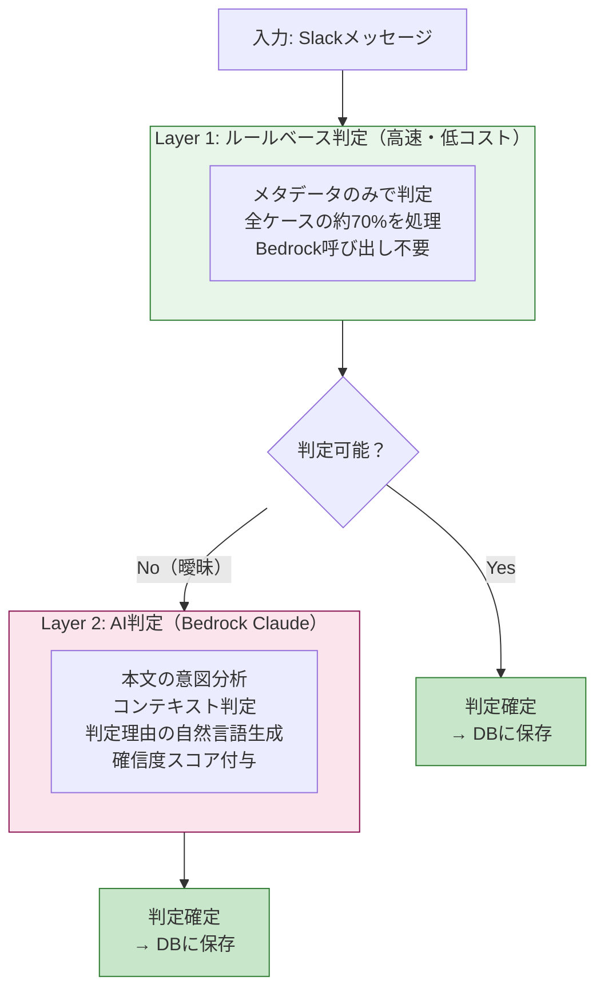
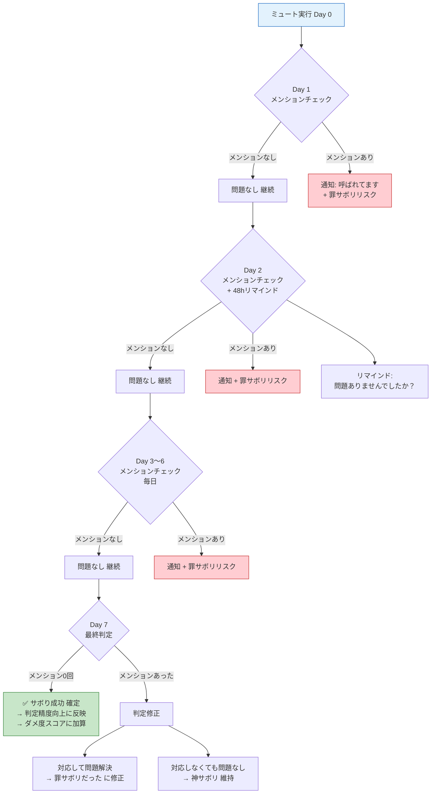
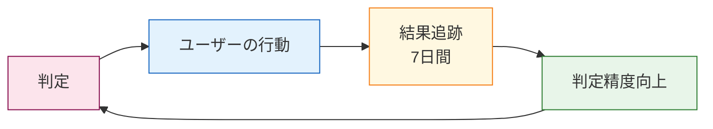

# 判定ロジック詳細設計

> **目的**: チャット（Slack）データから「神サボリ/罪サボリ/偽マジメ」を判定するロジックの詳細定義

---

## 判定アーキテクチャ: ハイブリッド2層構造



---

## Layer 1: ルールベース判定

### 即時判定ルール（メタデータのみ）

| # | 条件 | 判定 | 確信度 |
|---|------|------|:---:|
| R1 | 18:00以降の自分の発言 | 🟡 偽マジメ | 95% |
| R2 | 過去30日メンション0回のチャンネルでの自分の発言 | 🟡 偽マジメ | 90% |
| R3 | 過去30日メンション0回のチャンネルの未読 | 🟢 神サボリ（ミュート推奨） | 95% |
| R4 | 自分宛ダイレクトメンション（質問キーワード含む） | 🔴 罪サボリ | 85% |
| R5 | 自分の発言への反応が3回連続0件 | 🟡 偽マジメ候補 | 75% |
| R6 | 即レス（5分以内）したが相手の次の返信まで4時間以上 | 🟡 偽マジメ（即レス不要だった） | 80% |

### 質問キーワード（R4用）

```
日本語: 「？」「教えて」「確認」「お願い」「いつまで」「期限」「至急」「ASAP」
英語: "?", "please", "could you", "deadline", "urgent", "ASAP"
```

### Layer 1で判定不可 → Layer 2に回すケース

- メンションありだが質問キーワードなし
- 反応なしだが投稿が報告系かもしれない
- 時間内だが発言の価値が不明
- 確信度が75%未満

---

## Layer 2: AI判定（Bedrock Claude）

### プロンプト設計

```
あなたはSlackメッセージの分析AIです。
以下のメッセージを分析し、3分類のいずれかに判定してください。

【3分類の定義】
- 神サボリ: やらなくても何も困らないこと。対応不要。
- 罪サボリ: サボると後で困ること。対応必須。
- 偽マジメ: 頑張っているけど実は無意味なこと。やめるべき。

【判定時の注意】
- 報告系の投稿（「〇〇完了しました」等）は、反応がなくても「正常」です。偽マジメではありません。
- 情報共有（「FYI: 〇〇」等）は、閲覧されていれば価値があります。
- 質問への回答は、質問者が解決すれば十分です。反応不要。
- 上司への報告は、受領されれば十分です。

【入力データ】
- チャンネル名: {channel_name}
- 投稿者: {user_name}（分析対象ユーザー）
- メッセージ本文: {message_text}
- タイムスタンプ: {timestamp}
- リアクション数: {reaction_count}
- スレッド返信数: {thread_reply_count}
- メンション先: {mentions}
- チャンネルの過去30日統計:
  - 対象ユーザーへのメンション回数: {mention_count}
  - 対象ユーザーの発言への平均反応数: {avg_reaction}

【出力形式（JSON）】
{
  "classification": "神サボリ" | "罪サボリ" | "偽マジメ" | "正常",
  "confidence": 0.0〜1.0,
  "reason": "判定理由（ユーザーに表示する説明文）",
  "learning_point": "💡学びポイント（ユーザーがサボり方を学ぶためのアドバイス）",
  "action_suggestion": "次のアクション提案（任意）"
}
```

### AI判定の「正常」カテゴリ

3分類に加えて「正常」を設ける。全てが神サボリ/罪サボリ/偽マジメに分類されるわけではない。

| 分類 | 意味 | ユーザーへの表示 |
|------|------|----------------|
| 神サボリ | やらなくてよかった | 「サボってOK！」 |
| 罪サボリ | やるべきだった | 「これはサボっちゃダメ」 |
| 偽マジメ | やったけど無意味 | 「頑張ったけど意味なかった」 |
| **正常** | 適切な行動 | 表示しない（判定対象外） |

---

## パターン別判定表

### 「反応なし」の判定パターン

| パターン | 投稿タイプ | 反応 | 判定 | 理由 |
|---------|----------|:---:|------|------|
| 上司への報告 | 「〇〇完了しました」 | なし | **正常** | 報告は受領されれば十分 |
| 情報共有 | 「FYI: 〇〇のリンクです」 | なし | **正常** | 閲覧されていれば価値あり |
| 質問への回答 | 「〇〇は△△です」 | なし | **正常** | 質問者が解決すれば十分 |
| 雑談チャンネルでの発言 | 「今日暑いですね」 | なし（3回連続） | **偽マジメ** | 誰も反応しない雑談は時間の浪費 |
| 全体通知チャンネルでの発言 | 「了解です」 | なし（3回連続） | **偽マジメ** | 求められていない発言 |
| 自分から質問 | 「〇〇ってどうすれば？」 | なし | **判定保留** | 回答待ち。時間経過後に再判定 |

### 「時間外」の判定パターン

| パターン | 時間帯 | 内容 | 判定 | 理由 |
|---------|--------|------|------|------|
| 即レス | 18:00以降 | 通常の返信 | **偽マジメ** | 翌朝で間に合う |
| 緊急対応 | 18:00以降 | 「至急」「障害」キーワード含む | **罪サボリ（対応必要）** | 緊急時は対応すべき |
| 雑談 | 18:00以降 | 雑談チャンネル | **偽マジメ** | 業務外の雑談は翌日でよい |
| 自発的投稿 | 18:00以降 | 自分から発信 | **偽マジメ** | 翌朝に投稿すれば十分 |

### 「即レス」の判定パターン

| パターン | 応答時間 | 相手の次の返信 | 判定 | 理由 |
|---------|:---:|:---:|------|------|
| 即レス（5分以内） | 5分 | 相手が4時間後に返信 | **偽マジメ** | 急ぐ必要がなかった |
| 即レス（5分以内） | 5分 | 相手が10分後に返信 | **正常** | 会話のテンポとして適切 |
| 遅延レス（2時間後） | 2時間 | 問題なし | **神サボリ（成功）** | 即レスしなくても問題なかった |

---

## 行動追跡の判定ロジック

### ミュート後の追跡フロー



---

## 判定精度の向上メカニズム

### フィードバックループ



| フィードバック | 影響 |
|-------------|------|
| ミュートして7日間問題なし | 同チャンネルの「神サボリ」確信度が上がる |
| ミュートしたらメンションされた | 同チャンネルの「神サボリ」確信度が下がる |
| 即レスしなくて問題なし | 「即レス不要」の確信度が上がる |
| 即レスしなくて問題発生 | 「罪サボリ」として学習 |
| ユーザーが「問題あり」報告 | 該当パターンの判定を修正 |

### 初学者モード（データ不足時）

データが3日未満の場合、個人データに基づく判定は行わず、一般的なTipsを配信：

| 日数 | モード | 内容 |
|:---:|------|------|
| 0〜2日 | 初学者モード | 一般的なサボりTips配信（解析不要） |
| 3〜7日 | 学習モード | Layer 1（ルールベース）のみで判定開始 |
| 8日以降 | 通常モード | Layer 1 + Layer 2（AI判定）のフル機能 |

---

## 判定結果の出力形式

### 定時レスポンス（18:00）での表示

```
✅ 神サボリ: 5件
  ・#general の雑談を既読スルー → 問題なし
    💡 学び: メンションがない投稿は、あなた宛ではありません
  ・#project-updates を未読スルー → 問題なし
    💡 学び: このチャンネルであなたが呼ばれた回数: 過去30日で0回

🟡 偽マジメ: 2件
  ・誰も反応しないチャンネルで発言（10分の浪費）
    💡 学び: 過去3回の発言に反応ゼロ。このチャンネルでの発言は不要です
    🎯 提案: このチャンネルをミュートしてみましょう
  ・19:30にSlackで即レス（明日でよかった）
    💡 学び: 相手の次の返信は翌朝9:15でした。急ぐ必要はありませんでした
    🎯 提案: 18時以降は翌朝対応にしましょう

🔴 罪サボリ: 0件
  ・今日はパーフェクト！
```

### ダッシュボードでの表示

各判定結果に以下を含める：
- **分類ラベル**（神サボリ/罪サボリ/偽マジメ/正常）
- **確信度**（%表示）
- **判定理由**（1〜2文）
- **学びポイント**（💡）
- **次のアクション提案**（🎯、該当する場合のみ）
