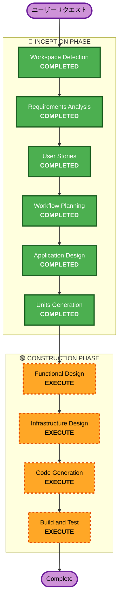

# Execution Plan

> **プロジェクト**: マジメニサボル（マジサボ）
> **タイプ**: Greenfield
> **作成日**: 2026-05-06

---

## 分析サマリー

### Change Impact Assessment
- **User-facing changes**: Yes — 完全に新しいサービス。全機能がユーザー向け
- **Structural changes**: Yes — 新規アーキテクチャの設計が必要
- **Data model changes**: Yes — チャットデータ、判定結果、スコアのデータモデルが必要
- **API changes**: Yes — 全APIが新規設計
- **NFR impact**: Low — ハッカソンプロトタイプのため、NFRは最小限

### Risk Assessment
- **Risk Level**: Medium
- **理由**: Slack API連携の工数が読みにくい。Bedrock判定ロジックの精度調整が必要
- **Rollback Complexity**: Easy（Greenfield、本番環境なし）
- **Testing Complexity**: Moderate（AI判定の精度テストが必要）

---

## Workflow Visualization

---

## Phases to Execute

### 🔵 INCEPTION PHASE
- [x] Workspace Detection — COMPLETED
- [x] Requirements Analysis — COMPLETED
- [x] User Stories — COMPLETED
- [x] Workflow Planning — COMPLETED
- [x] **Application Design** — COMPLETED
  - **Rationale**: 8コンポーネント、6サービス、ハイブリッド判定アーキテクチャ、Unit別データ保持方針を設計
- [x] **Units Generation** — COMPLETED
  - **Rationale**: 8 Unit（マイクロサービス）× 独立CDKスタック。コアフロー優先方針を策定

### スキップしたステージ（INCEPTION）
- Reverse Engineering — SKIP（Greenfield）
- NFR Requirements — SKIP（ハッカソンプロトタイプ、NFR最小限）
- NFR Design — SKIP（同上）

### 🟢 CONSTRUCTION PHASE（予選MVP実装時に実行）
- [ ] **Functional Design** — EXECUTE
  - **Rationale**: 判定ロジック詳細（judgment-logic.mdで先行設計済み）、ダメ度スコア算出、定時レスポンス生成
- [ ] **Infrastructure Design** — EXECUTE
  - **Rationale**: AWS CDKスタック設計（8スタック）、DynamoDBテーブル詳細、EventBridgeルール
- [ ] **Code Generation** — EXECUTE（ALWAYS）
  - **Rationale**: 実装コードの生成
- [ ] **Build and Test** — EXECUTE（ALWAYS）
  - **Rationale**: ビルド・テスト手順の作成

### スキップするステージ（CONSTRUCTION）
- NFR Requirements — SKIP（ハッカソンプロトタイプ）
- NFR Design — SKIP（同上）

### 🟡 OPERATIONS PHASE
- Operations — PLACEHOLDER（将来）

---

## 実行順序

| # | ステージ | 目的 | 推定時間 |
|---|---------|------|:---:|
| 1 | Application Design | コンポーネント構成・API・判定ロジック設計 | 1〜2時間 |
| 2 | Units Generation | Unit分割（審査基準直結） | 30分〜1時間 |
| 3 | Functional Design | 判定ロジック詳細・データモデル | 1時間 |
| 4 | Infrastructure Design | AWS構成設計 | 30分 |
| 5 | Code Generation | 実装コード生成 | 実装期間 |
| 6 | Build and Test | テスト手順作成 | 30分 |

---

## 書類審査（5/10）までに必要なもの

| 成果物 | ステージ | 状態 |
|--------|---------|:---:|
| ビジネス意図の説明 | Requirements | ✅ 完了 |
| Unit分解 | Units Generation | ✅ 完了 |
| 創造性・テーマ適合性 | Requirements | ✅ 完了 |
| ドキュメント品質 | 全体 | ✅ 完了 |
| GitHubリポジトリ | — | 🟡 push待ち |

---

## Success Criteria
- **Primary Goal**: 書類審査通過（5/10提出、5/15結果）
- **Key Deliverables**: ✅ 全て完了
  - Application Design（8コンポーネント、6サービス、ハイブリッド判定）
  - Units Generation（8 Unit × 独立CDKスタック）
  - GitHubリポジトリ（Inception成果物を格納）— push待ち
- **Quality Gates**: ✅ 全てクリア
  - 審査基準4項目（ビジネス意図、Unit分解、創造性、ドキュメント品質）を全てカバー
  - ドキュメント間の整合性が取れている
  - 表記揺れなし
