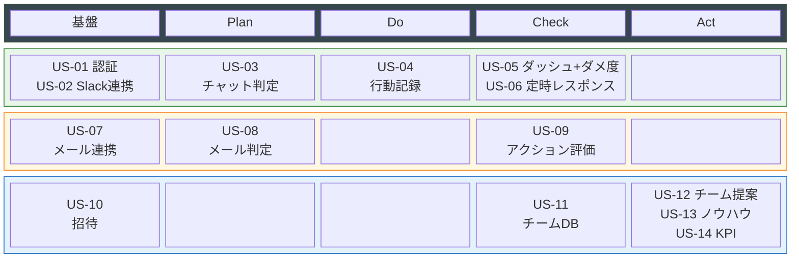

# ユーザーストーリー

> **サービス名**: マジメニサボル（マジサボ）
> **コンセプト**: サボり方を教える学習サービス（便利ツールではない）
> **メインデータソース**: チャット（Slack）
> **総ストーリー数**: 15（予選MVP Must: 6、予選Should: 4、決勝: 5）

---

## 予選MVP Must（6件）— チャット判定でPDCA一巡

### US-01: ユーザー登録・ログイン

**As a** 佐藤（個人ユーザー）
**I want to** アカウントを作成し、ログインしたい
**So that** 自分の判定結果やダメ度スコアが保存され、サボり方の学習が継続できる

**PDCAフェーズ**: 基盤
**MVPスコープ**: 予選Must
**優先度**: Must

#### 受入基準
1. **Given** 未登録のユーザーが **When** メールアドレスとパスワードで登録する **Then** アカウントが作成され、ダッシュボードに遷移する
2. **Given** 登録済みのユーザーが **When** 正しい認証情報でログインする **Then** 自分のダッシュボードが表示される
3. **Given** 登録済みのユーザーが **When** 誤ったパスワードでログインする **Then** エラーメッセージが表示され、ログインできない

---

### US-02: チャットデータ連携

**As a** 鈴木（リモートワーカー）
**I want to** Slackのチャットデータをマジサボに取り込みたい
**So that** 自分のチャット活動が判定対象になり、サボり方を学べる

**PDCAフェーズ**: 基盤
**MVPスコープ**: 予選Must
**優先度**: Must

#### 受入基準
1. **Given** ログイン済みのユーザーが **When** Slack連携を設定する **Then** 参加チャンネル一覧、発言数、メンション数、リアクション数が取得される
2. **Given** Slack連携済みのユーザーの **When** メッセージ本文がAI分析される **Then** 質問・依頼・期限の有無が判定され、本文は分析後に破棄される
3. **Given** Slack連携が難しい場合 **When** エクスポートファイル（JSON/CSV）やテキストファイルをアップロードする **Then** 同等の分析が実行される

---

### US-03: チャットの判定（Plan）

**As a** 佐藤（個人ユーザー）
**I want to** 「このチャンネルはミュートしていい」「即レス不要」の判定と、その理由を見たい
**So that** なぜサボっていいかを理解し、サボり方を学べる

**PDCAフェーズ**: Plan
**MVPスコープ**: 予選Must
**優先度**: Must

#### 受入基準
1. **Given** チャット連携済みのユーザーが **When** Planページを開く **Then** チャンネル一覧に「ミュート推奨（神サボリ）」「通常監視」「要注意（罪サボリリスク）」のラベルが表示される
2. **Given** 過去30日で自分へのメンションが0回のチャンネルが **When** 判定される **Then** 「ミュート推奨」と表示され、理由「過去30日であなたは呼ばれていません」が説明される
3. **Given** 自分の発言に対するリアクション・返信が平均0.5件以下（3回以上）のチャンネルが **When** 判定される **Then** 「偽マジメ」と表示され、理由「発言しても誰も反応しません。この発言は不要です」が説明される
4. **Given** 報告系・情報共有目的の投稿で反応がない場合 **When** 判定される **Then** 「正常」と判定され、「報告は受領されれば十分。反応がなくても問題ありません」と説明される
5. **Given** 時間外（18:00以降）の発言がある **When** 判定される **Then** 「偽マジメ」と表示され、理由「この時間の対応は翌朝で間に合います」が説明される

---

### US-04: 行動の記録（Do）

**As a** 佐藤（個人ユーザー）
**I want to** 判定に従って行動した結果（ミュートした/即レスしなかった）を記録し、1週間追跡してほしい
**So that** 「サボっても問題なかった」という実績が確実に蓄積され、サボる自信がつく

**PDCAフェーズ**: Do
**MVPスコープ**: 予選Must
**優先度**: Must

#### 受入基準
1. **Given** ミュート推奨のチャンネルを **When** 実際にミュートした **Then** ミュート実行が記録され、1週間の追跡が開始される
2. **Given** ミュートから48時間経過した **When** 定時レスポンスが届く **Then** 「ミュートしたチャンネル、問題ありませんでしたか？」のリマインドが含まれる
3. **Given** ミュートしたチャンネルで **When** 24時間ごとにメンションチェックが実行される **Then** メンションなし→「問題なし」継続、メンションあり→「呼ばれてます」通知＋罪サボリリスク記録
4. **Given** 1週間経過してメンション0回の場合 **When** 最終判定が行われる **Then** 「サボり成功」として確定し、次回の判定精度に反映される
5. **Given** 追跡中にユーザーが「問題あり」を報告した場合 **When** 報告を受け付ける **Then** 罪サボリとして記録され、次回の判定に反映される

---

### US-05: ダッシュボード＋ダメ度スコア（Check）

**As a** 佐藤（個人ユーザー）
**I want to** ダメ度スコアと判定結果の内訳をダッシュボードで見たい
**So that** 「どれだけサボり方が上達しているか」を定量的に把握できる

**PDCAフェーズ**: Check
**MVPスコープ**: 予選Must
**優先度**: Must

#### 受入基準
1. **Given** 1日以上のデータがある **When** ダッシュボードを開く **Then** ダメ度スコア（0〜100）と評価ランク（「勤勉すぎ」〜「ダメ度マスター」）が表示される
2. **Given** 判定データがある **When** ダッシュボードを開く **Then** 神サボリ/罪サボリ/偽マジメの件数・割合が表示される
3. **Given** 複数日のデータがある **When** ダッシュボードを開く **Then** ダメ度の日次トレンドグラフが表示され、サボりスキルの成長が可視化される
4. **Given** スキップして問題なかった実績がある **When** ダッシュボードを開く **Then** 「安心実績: X回サボって問題ゼロ」「創出時間: Y時間」が表示される
5. **Given** ダメ度が20以下の **When** スコアを確認する **Then** 「あなたは頑張りすぎです。もっとダメになりましょう」とメッセージが表示される

---

### US-06: 定時レスポンス（Check）

**As a** 佐藤（個人ユーザー）
**I want to** 毎日18:00に「今日のマジサボレポート」を受け取りたい
**So that** 1日の振り返りが自動で届き、サボり方の学びが毎日蓄積される

**PDCAフェーズ**: Check
**MVPスコープ**: 予選Must
**優先度**: Must

#### 受入基準
1. **Given** 1日分のデータがある **When** 18:00になる **Then** Slack DM（or Web通知）で「今日のマジサボレポート」が届く
2. **Given** レポートが届いた **When** 内容を確認する **Then** ダメ度スコア、神サボリ/偽マジメ/罪サボリの件数と具体例、創出時間が表示される
3. **Given** 偽マジメが検出された **When** レポートに含まれる **Then** 「なぜ不要だったか」の理由と「💡 学び」が表示される
4. **Given** 18:00以降にSlack発言がある **When** レポートに含まれる **Then** 「時間外労働アラート: この時間の対応は全て偽マジメです」と表示される
5. **Given** レポートが届いた **When** 内容を確認する **Then** ユーモアのある一言コメントが含まれる

---

## 予選MVP Should（3件）

### US-07: メールデータ連携

**As a** 佐藤（個人ユーザー）
**I want to** メールデータもマジサボに取り込みたい
**So that** チャットだけでなくメールのサボり方も学べる

**PDCAフェーズ**: 基盤
**MVPスコープ**: 予選Should
**優先度**: Should

#### 受入基準
1. **Given** ログイン済みのユーザーが **When** メール転送を設定する **Then** 受信メールのメタデータと本文が取得・分析される
2. **Given** メール連携済みのユーザーに **When** 新しいメールが届く **Then** 自動的に判定対象として取り込まれる
3. **Given** メール本文が分析された **When** 判定が完了する **Then** 本文は破棄され、メタデータと判定結果のみ保存される

---

### US-08: メール判定

**As a** 佐藤（個人ユーザー）
**I want to** 「この返信は不要」「テンプレで十分」の判定と理由を見たい
**So that** メールでのサボり方も学べる

**PDCAフェーズ**: Plan
**MVPスコープ**: 予選Should
**優先度**: Should

#### 受入基準
1. **Given** メール連携済みのユーザーが **When** Planページを開く **Then** 未返信メール一覧に「神サボリ（返信不要）」「罪サボリ（要返信）」「偽マジメ（テンプレで十分）」のラベルと理由が表示される
2. **Given** CCのみで受信したメールが **When** 判定される **Then** 過去の返信実績と反応有無に基づいて判定される
3. **Given** 判定理由が表示された **When** 確認する **Then** 「過去10通のこのスレッド: あなたの返信後に反応: 0回」等の具体的根拠が表示される

---

### US-09: アクション評価（やったことへのスコア）

**As a** 山下（若手社員）
**I want to** 自分がやったチャット発言に対して「それ、必要だった？」のスコアと理由がほしい
**So that** 自分がどれだけ無駄なことをしているかに気づき、サボり方を学べる

**PDCAフェーズ**: Check
**MVPスコープ**: 予選Should
**優先度**: Should

#### 受入基準
1. **Given** 1日分のチャット発言データがある **When** アクション評価を確認する **Then** 「価値あり / 既読スルーでよかった / 時間外の不要対応」の内訳が表示される
2. **Given** 不要だったアクションが特定された **When** 詳細を確認する **Then** 「この発言は反応0件。なぜなら〇〇だからです」と理由が説明される
3. **Given** 効率スコアが表示された **When** 確認する **Then** 「あなたの行動のX%は不要でした。明日は"やらない"を意識してみましょう」とメッセージが表示される

---

### US-10: 会議判定（Slack経由）

**As a** 佐藤（個人ユーザー）
**I want to** Slack上の会議招集・リマインドから「この会議に出る必要があるか」を判定してほしい
**So that** カレンダー連携なしで、会議のサボり方も学べる

**PDCAフェーズ**: Plan
**MVPスコープ**: 予選Should
**優先度**: Should

#### 受入基準
1. **Given** Slack上にカレンダーBot通知やZoom/Teamsリンク付きメッセージがある **When** 会議が検出される **Then** 「神サボリ候補（欠席推奨）」「罪サボリ（出席必須）」のラベルと理由が表示される
2. **Given** 過去3回の同じ会議で自分の発言が0回の場合 **When** 判定される **Then** 「欠席しても問題ない可能性が高い。過去3回発言ゼロ」と表示される
3. **Given** 自分が主催者または発表者の会議が **When** 判定される **Then** 「出席必須」と判定され、神サボリ候補にならない
4. **Given** 会議を欠席した **When** 7日間追跡される **Then** メンション0回＋問題報告なしで「サボリ成功」確定

---

## 決勝スケール用ストーリー（5件）

### US-11: チームメンバー招待

**As a** 田中（チームリーダー）
**I want to** チームメンバーをマジサボに招待し、チームとして紐づけたい
**So that** メンバーの個人データがチームダッシュボードに集約される

**PDCAフェーズ**: 基盤（チームレベル）
**MVPスコープ**: 決勝
**優先度**: Must（決勝時）

#### 受入基準
1. **Given** チームリーダーが **When** メンバーのメールアドレスで招待する **Then** 招待が送信され、承認後にチームに追加される
2. **Given** メンバーがチームに参加した **When** メンバーの判定結果が生成される **Then** 個人データがチームダッシュボードに匿名集計される

---

### US-12: チームダッシュボード

**As a** 田中（チームリーダー）
**I want to** チーム全体の偽マジメコストと時間創出量を一覧で見たい
**So that** チームの無駄なコミュニケーションを特定し、組織改善の根拠にできる

**PDCAフェーズ**: Check（チームレベル）
**MVPスコープ**: 決勝
**優先度**: Must（決勝時）

#### 受入基準
1. **Given** チームメンバーが3名以上利用している **When** チームダッシュボードを開く **Then** チーム全体の偽マジメコスト（時間×人件費単価）が表示される
2. **Given** チームデータがある **When** チャンネル別の分析を見る **Then** 「このチャンネルは発言者3名のみ。残り8名はミュート推奨」等の分析が表示される

---

### US-13: チーム改善提案

**As a** 田中（チームリーダー）
**I want to** 「このチャンネルは統合しても問題ない」というデータに基づいた提案がほしい
**So that** 角を立てずにコミュニケーションを整理できる

**PDCAフェーズ**: Act（チームレベル）
**MVPスコープ**: 決勝
**優先度**: Must（決勝時）

#### 受入基準
1. **Given** チームの判定データが蓄積された **When** チーム改善提案を開く **Then** 「統合候補チャンネル」「ミュート推奨メンバー」のリストが表示される
2. **Given** 改善提案を実行した **When** 翌月のレポートを確認する **Then** 「先月の改善により、チームで月X時間を創出」と効果が可視化される

---

### US-14: 怠惰ノウハウの自動共有

**As a** 田中（チームリーダー）
**I want to** チーム内で「うまくサボれた事例」が匿名で自動共有されてほしい
**So that** 個人を晒さずに、チーム全体のサボりスキルが底上げされる

**PDCAフェーズ**: Act（チームレベル）
**MVPスコープ**: 決勝
**優先度**: Should（決勝時）

#### 受入基準
1. **Given** チームメンバーの判定データが蓄積された **When** 週次で自動生成される **Then** 「今週のサボりTips」が匿名でチーム全体に配信される
2. **Given** Tipsが配信された **When** 内容を確認する **Then** 具体的な事例（「#project-updates は週1チェックで十分」等）が含まれる
3. **Given** Tipsが配信された **When** 個人を特定しようとする **Then** 全て匿名化されており、誰の実績かは分からない

---

### US-15: 組織KPIレポート

**As a** 中村（バックオフィス）
**I want to** 全社の偽マジメコストレポートを経営会議に提出したい
**So that** 「働き方改革」の成果を数値で示せる

**PDCAフェーズ**: Act（組織レベル）
**MVPスコープ**: 決勝
**優先度**: Should（決勝時）

#### 受入基準
1. **Given** 複数チームのデータがある **When** KPIレポートを生成する **Then** 全社の偽マジメコスト、時間創出量、改善トレンドがレポートに含まれる
2. **Given** レポートが生成された **When** ダウンロードする **Then** PDF形式で出力される

---

## ストーリーマップ

**凡例**: 🟢 予選Must（6件） / 🟡 予選Should（3件） / 🔵 決勝（5件）

---

## MVPスコープ境界

| スコープ | ストーリー | 合計 |
|---------|-----------|------|
| **予選MVP Must** | US-01〜US-06 | 6件 |
| **予選MVP Should** | US-07〜US-09 | 3件 |
| **決勝** | US-10〜US-14 | 5件 |

### 予選Must 6件の工数見積もり

3人 × 2.5週間 = 約37.5人日

| ストーリー | 推定工数 | 担当イメージ |
|-----------|:---:|------------|
| US-01 認証 | 1.5日 | インフラ担当 |
| US-02 Slack連携 | 3日 | バックエンド担当 |
| US-03 チャット判定 | 4日 | バックエンド担当（Bedrock連携含む） |
| US-04 行動記録 | 2日 | バックエンド担当 |
| US-05 ダッシュボード＋ダメ度 | 5日 | フロントエンド担当 |
| US-06 定時レスポンス | 2.5日 | インフラ担当（EventBridge） |
| **合計** | **18日** | **3人で約6日 = 余裕あり** |

---

## ペルソナ × ストーリー対応表

| ペルソナ | 主要ストーリー | 固有の価値 |
|---------|--------------|-----------|
| 佐藤 健太（中堅PL） | US-03, US-04, US-05, US-06 | サボり方を学び、ダメ度を上げる |
| 山下 翔太（若手） | US-09 | 自分の無駄に気づき、サボる判断力を身につける |
| 鈴木 あゆみ（リモート） | US-02, US-03 | 即レス不要を学び、集中時間を確保 |
| 田中 美咲（チームリーダー） | US-10, US-11, US-12, US-13 | チームのサボりスキルを底上げ |
| 中村 裕子（バックオフィス） | US-14 | 全社の働き方改革を数値で推進 |
